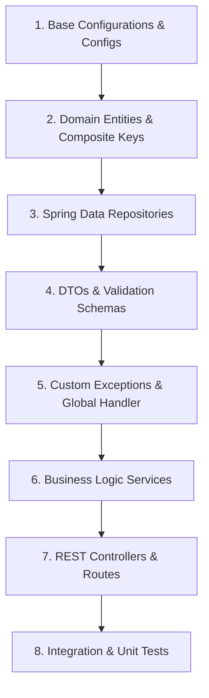

# Smart Job Board Database Design Document
**Author:** Senior Solution Architect, Database Architect & Spring Boot Technical Lead
**Date:** July 27, 2026

This document presents a production-ready, highly normalized, and scalable relational database design for the **Smart Job Board Application**, utilizing **PostgreSQL** as the database engine and designed to seamlessly map to **Spring Boot JPA (Hibernate)** entities.

---

## 1. Requirement Analysis

### 1.1 Main Entities
1. **User**: Represents all actors in the system (Job Seekers, Employers, Administrators). This centralizes authentication credentials and common audit metadata.
2. **Company**: Represents organizations that post jobs. Associated with one or more Employer users.
3. **Job**: Represents a vacancy listing. Belongs to a Category and a Company, and has specific skills.
4. **Category**: Represents job categories (e.g., Software Engineering, Design, Finance) for navigation and classification.
5. **Skill**: Represents skills (e.g., Java, Spring Boot, React) associated with categories.
6. **Application**: Represents a job seeker's submission for a job.
7. **Recruiter Profile / Seeker Profile**: Specialized profiles for employers and candidates to avoid overloading the user table with role-specific nullable columns.

### 1.2 Key Business Rules
* **Email Uniqueness**: Each user must register with a unique email.
* **Role-Based Profiles**: An Employer user must be associated with a Company. A Job Seeker must have a profile that holds their resume and skills.
* **One Application per Job**: A candidate can apply for a specific job only once. Subsequent attempts will be rejected by unique constraints.
* **Audit Trail**: Every change in an application status must be logged in a status history table.
* **Integrity Constraints**: Companies and categories cannot be deleted if there are active jobs referencing them (`ON DELETE RESTRICT`).

### 1.3 Future Scalability Considerations
* **UUIDs for Primary Keys**: Instead of auto-incrementing integers, UUIDs prevent enumeration attacks and ease potential multi-region DB merges.
* **Soft Deletions / Status Flags**: Jobs and applications use status enums (`DRAFT`, `ACTIVE`, `CLOSED`, `ARCHIVED`) rather than raw physical deletions.
* **Profile Separation**: Separating `users` (auth-focused) from profiles ensures that adding seeker-specific fields (e.g., certifications, education history) does not impact recruiter profiles.

---

## 2. Entity Identification & Schema Details

### 2.1 Table: `users`
* **Purpose**: Central credential storage, role tracking, and authentication.
* **Columns**:
  * `id` (`UUID`, Primary Key): Default generated using `gen_random_uuid()`.
  * `email` (`VARCHAR(255)`, Not Null, Unique): Account email address.
  * `password_hash` (`VARCHAR(255)`, Not Null): Bcrypt hashed password.
  * `first_name` (`VARCHAR(100)`, Not Null): User's first name.
  * `last_name` (`VARCHAR(100)`, Not Null): User's last name.
  * `phone_number` (`VARCHAR(20)`, Nullable): Contact phone number.
  * `role` (`VARCHAR(20)`, Not Null): Must be `'ADMIN'`, `'EMPLOYER'`, or `'JOB_SEEKER'`.
  * `is_active` (`BOOLEAN`, Not Null, Default `TRUE`): Flag for account lock/suspension.
  * `created_at` / `updated_at` (`TIMESTAMP WITH TIME ZONE`, Not Null): Audit timestamps.

### 2.2 Table: `companies`
* **Purpose**: Represents an employer's company.
* **Columns**:
  * `id` (`UUID`, Primary Key): Unique identifier.
  * `name` (`VARCHAR(255)`, Not Null, Unique): Legal/common name of the company.
  * `slug` (`VARCHAR(255)`, Not Null, Unique): Clean URL slug.
  * `website` (`VARCHAR(255)`, Nullable): Corporate website URL.
  * `logo_url` (`VARCHAR(500)`, Nullable): URL to company logo stored in CDN.
  * `description` (`TEXT`, Nullable): Detailed corporate bio.
  * `industry` (`VARCHAR(100)`, Nullable): Sector (e.g., Financial Services, Software).
  * `founded_date` (`DATE`, Nullable): Date established.
  * `headquarters` (`VARCHAR(255)`, Nullable): City/Country of HQ.
  * `created_by` (`UUID`, Foreign Key referencing `users(id)`, Not Null): Employer who registered it.

### 2.3 Table: `recruiter_profiles`
* **Purpose**: Maps an employer user to a specific company and provides administrative metadata.
* **Columns**:
  * `user_id` (`UUID`, Primary Key, Foreign Key referencing `users(id)` with `ON DELETE CASCADE`).
  * `company_id` (`UUID`, Foreign Key referencing `companies(id)` with `ON DELETE RESTRICT`, Not Null).
  * `job_title` (`VARCHAR(100)`, Nullable): e.g., "Director of Talent Acquisition".

### 2.4 Table: `seeker_profiles`
* **Purpose**: Holds seeker-specific metadata (resumes, portfolios, bios).
* **Columns**:
  * `user_id` (`UUID`, Primary Key, Foreign Key referencing `users(id)` with `ON DELETE CASCADE`).
  * `bio` (`TEXT`, Nullable): Short introduction.
  * `resume_url` (`VARCHAR(500)`, Nullable): Link to their primary resume.
  * `github_url` (`VARCHAR(255)`, Nullable): Social coding link.
  * `linkedin_url` (`VARCHAR(255)`, Nullable): Professional network link.
  * `portfolio_url` (`VARCHAR(255)`, Nullable): Personal project site.

### 2.5 Table: `categories`
* **Purpose**: Job classification tree.
* **Columns**:
  * `id` (`UUID`, Primary Key).
  * `name` (`VARCHAR(100)`, Not Null, Unique).
  * `slug` (`VARCHAR(100)`, Not Null, Unique).
  * `description` (`VARCHAR(255)`, Nullable).

### 2.6 Table: `skills`
* **Purpose**: Central registry of professional skills.
* **Columns**:
  * `id` (`UUID`, Primary Key).
  * `name` (`VARCHAR(100)`, Not Null, Unique).
  * `category_id` (`UUID`, Foreign Key referencing `categories(id)` with `ON DELETE SET NULL`, Nullable).

### 2.7 Table: `jobs`
* **Purpose**: Postings representing vacancies.
* **Columns**:
  * `id` (`UUID`, Primary Key).
  * `company_id` (`UUID`, Foreign Key referencing `companies(id)` with `ON DELETE RESTRICT`, Not Null).
  * `category_id` (`UUID`, Foreign Key referencing `categories(id)` with `ON DELETE RESTRICT`, Not Null).
  * `posted_by` (`UUID`, Foreign Key referencing `users(id)` with `ON DELETE RESTRICT`, Not Null).
  * `title` (`VARCHAR(255)`, Not Null): Listing title.
  * `description` (`TEXT`, Not Null): Detail description of role.
  * `requirements` (`TEXT`, Nullable): Bulleted technical requirements.
  * `responsibilities` (`TEXT`, Nullable): Bulleted day-to-day responsibilities.
  * `location` (`VARCHAR(255)`, Not Null): e.g., "Remote", "New York, NY".
  * `job_type` (`VARCHAR(50)`, Not Null): Must be `'FULL_TIME'`, `'PART_TIME'`, `'CONTRACT'`, `'INTERNSHIP'`, `'REMOTE'`, or `'TEMPORARY'`.
  * `experience_level` (`VARCHAR(50)`, Not Null): Must be `'ENTRY'`, `'MID'`, `'SENIOR'`, `'LEAD'`, or `'EXECUTIVE'`.
  * `salary_min` / `salary_max` (`DECIMAL(15, 2)`, Nullable): Wage range.
  * `currency` (`VARCHAR(3)`, Default `'USD'`, Not Null): Currency tag.
  * `status` (`VARCHAR(20)`, Default `'DRAFT'`, Not Null): Must be `'DRAFT'`, `'ACTIVE'`, `'CLOSED'`, or `'ARCHIVED'`.
  * `expires_at` (`TIMESTAMP WITH TIME ZONE`, Nullable).

### 2.8 Table: `job_skills` (Junction Table)
* **Purpose**: Skill tags for jobs.
* **Columns**:
  * `job_id` (`UUID`, PK, FK referencing `jobs(id)` with `ON DELETE CASCADE`).
  * `skill_id` (`UUID`, PK, FK referencing `skills(id)` with `ON DELETE RESTRICT`).
  * `importance` (`VARCHAR(20)`, Default `'REQUIRED'`, Not Null): Must be `'REQUIRED'` or `'PREFERRED'`.

### 2.9 Table: `seeker_skills` (Junction Table)
* **Purpose**: Skill tags for candidates.
* **Columns**:
  * `seeker_id` (`UUID`, PK, FK referencing `seeker_profiles(user_id)` with `ON DELETE CASCADE`).
  * `skill_id` (`UUID`, PK, FK referencing `skills(id)` with `ON DELETE RESTRICT`).
  * `proficiency_level` (`VARCHAR(20)`, Nullable): Must be `'BEGINNER'`, `'INTERMEDIATE'`, or `'EXPERT'`.

### 2.10 Table: `applications`
* **Purpose**: Applications submitted by seekers.
* **Columns**:
  * `id` (`UUID`, Primary Key).
  * `job_id` (`UUID`, Foreign Key referencing `jobs(id)` with `ON DELETE RESTRICT`, Not Null).
  * `seeker_id` (`UUID`, Foreign Key referencing `seeker_profiles(user_id)` with `ON DELETE RESTRICT`, Not Null).
  * `resume_url` (`VARCHAR(500)`, Nullable): Custom resume for this application. If null, falls back to profile resume.
  * `cover_letter` (`TEXT`, Nullable).
  * `status` (`VARCHAR(30)`, Default `'APPLIED'`, Not Null): Must be `'APPLIED'`, `'SCREENING'`, `'INTERVIEWING'`, `'OFFERED'`, `'REJECTED'`, or `'WITHDRAWN'`.

### 2.11 Table: `application_status_history` (Audit Log)
* **Purpose**: Tracks application state transitions over time.
* **Columns**:
  * `id` (`UUID`, Primary Key).
  * `application_id` (`UUID`, Foreign Key referencing `applications(id)` with `ON DELETE CASCADE`, Not Null).
  * `status` (`VARCHAR(30)`, Not Null): Status at this point in time.
  * `changed_by` (`UUID`, Foreign Key referencing `users(id)` with `ON DELETE RESTRICT`, Not Null).
  * `notes` (`TEXT`, Nullable).
  * `changed_at` (`TIMESTAMP WITH TIME ZONE`, Default `CURRENT_TIMESTAMP`, Not Null).

---

## 3. Relationships

| From Entity | Relationship | To Entity | Description / Rationale |
| :--- | :--- | :--- | :--- |
| `users` | 1-to-1 (Optional) | `recruiter_profiles` | Links core credentials to professional recruiter stats. Cascade deletion of profile when user deleted. |
| `users` | 1-to-1 (Optional) | `seeker_profiles` | Links core credentials to seeker profile. Cascade deletion of profile when user deleted. |
| `companies` | 1-to-Many | `recruiter_profiles` | An organization can have multiple recruiters. Prevents company deletion if recruiters are linked (`RESTRICT`). |
| `companies` | 1-to-Many | `jobs` | An organization can publish many job posts. Prevents deletion of company if jobs exist (`RESTRICT`). |
| `categories` | 1-to-Many | `jobs` | A category can contain many jobs. Prevents deletion of category if active listings exist (`RESTRICT`). |
| `categories` | 1-to-Many | `skills` | Group skills by categories. Deleting a category sets skills' category to null (`SET NULL`). |
| `jobs` | Many-to-Many | `skills` | Modeled via `job_skills` junction table. Links listing to multiple required/preferred skills. |
| `seeker_profiles`| Many-to-Many | `skills` | Modeled via `seeker_skills` junction table. Maps candidates to their proficiencies. |
| `jobs` | 1-to-Many | `applications` | A job post can receive multiple applications. |
| `seeker_profiles`| 1-to-Many | `applications` | A candidate can submit multiple job applications. |
| `applications` | 1-to-Many | `application_status_history`| Maintains sequential timeline of application stages. Cascade delete logs if application is purged. |

---

## 4. Entity-Relationship (ER) Diagram

```
                       +-------------------+
                       |       users       |
                       +-------------------+
                       | PK  id (UUID)     |<---------------+
                       |     email (UQ)    |                | (1-to-1)
                       |     role          |                |
                       +-------------------+                |
                        /                 \                 |
            (1)        /                   \ (1)            |
                      /                     \               |
                     v (0..1)                v (0..1)       |
           +--------------------+    +--------------------+ |
           | recruiter_profiles |    |   seeker_profiles  |-+
           +--------------------+    +--------------------+
           | PK/FK user_id      |    | PK/FK user_id      |<----------+
           |   FK  company_id   |    |       bio          |           | (1-to-Many)
           +--------------------+    +--------------------+           |
                     |                         |                      |
                     | (Many-to-1)             | (1-to-Many)          |
                     v                         v                      |
           +--------------------+    +--------------------+           |
           |      companies     |    |    seeker_skills   |           |
           +--------------------+    +--------------------+           |
           | PK  id (UUID)      |    | PK/FK seeker_id    |           |
           |     name (UQ)      |    | PK/FK skill_id     |           |
           +--------------------+    +--------------------+           |
                     |                         |                      |
                     | (1-to-Many)             | (Many-to-1)          |
                     v                         |                      |
           +--------------------+              |                      |
           |        jobs        |<-------------|                      |
           +--------------------+              |                      |
           | PK  id (UUID)      |              |                      |
           |   FK  company_id   |              |                      |
           |   FK  category_id  |              |                      |
           +--------------------+              |                      |
            /                  \               |                      |
           / (1-to-Many)        \ (1-to-Many)  |                      |
          v                      v             v                      |
+--------------------+    +--------------------+                      |
|     job_skills     |    |    applications    |----------------------+
+--------------------+    +--------------------+
| PK/FK job_id       |    | PK  id (UUID)      |<----------+
| PK/FK skill_id     |    |   FK  job_id       |           | (1-to-Many)
+--------------------+    |   FK  seeker_id    |           |
          |               +--------------------+           |
          | (Many-to-1)            |                       |
          v                        | (1-to-Many)           |
+--------------------+             v                       |
|       skills       |    +----------------------------+   |
+--------------------+    | application_status_history |---+
| PK  id (UUID)      |    +----------------------------+
|   FK  category_id  |    | PK  id (UUID)              |
+--------------------+    |   FK  application_id       |
          ^               +----------------------------+
          | (Many-to-1)
+--------------------+
|     categories     |
+--------------------+
| PK  id (UUID)      |
|     name (UQ)      |
+--------------------+
```

---

## 5. Normalization Explanation

The schema satisfies up to Third Normal Form (3NF) requirements:

* **First Normal Form (1NF)**:
  * All columns contain only atomic values. There are no multi-valued attributes (e.g., skills are not stored as a comma-separated list of strings in the `jobs` or `users` table; instead, they are normalized into separate tables and linked via relationship tables `job_skills` and `seeker_skills`).
  * Each table has a defined primary key (either a surrogate UUID or a composite primary key).

* **Second Normal Form (2NF)**:
  * The schema meets all 1NF rules.
  * Every non-key column in every table is fully functionally dependent on the entire primary key. In junction tables with composite keys (like `job_skills` with `(job_id, skill_id)`), non-prime attributes like `importance` depend on the *entire* key (both the job and the skill) rather than just a single part of it.

* **Third Normal Form (3NF)**:
  * The schema meets all 2NF rules.
  * There are no transitive dependencies. Non-key attributes depend only on the primary key, and not on other non-key attributes. For example, `jobs` references `company_id` and `category_id`. It does not store redundant info like `company_name` or `category_name` in the jobs table, which would depend transitively on `company_id`.

### Design Trade-offs
* **Profile Table Separation**: We split user profiles into `users`, `seeker_profiles`, and `recruiter_profiles`. While this requires an extra `JOIN` when loading candidate portfolios or company listings, it keeps the `users` table narrow, improving login performance, reducing index sizes, and isolating specialized attributes.
* **Audit Trail Redundancy**: The `applications` table stores the current `status` field, and the `application_status_history` table stores the transition log. Storing `status` on `applications` is technically redundant (as it could be derived by fetching the latest record in the status history). However, we store it directly in `applications` to avoid expensive subqueries when rendering the candidate dashboards or recruiter pipeline grids. We handle this trade-off using database integrity and transaction-managed updates in the Spring Boot service layer.

---

## 6. PostgreSQL DDL Scripts & Test Data

The full, runnable schema and test data files are created in the project repository:
1. Schema Definition script: [schema.sql](file:///c:/Users/user/smart-job-board/docs/schema.sql)
2. Seeding Test Data script: [sample_data.sql](file:///c:/Users/user/smart-job-board/docs/sample_data.sql)

To initialize or reset the database, run the following commands in order using `psql` or your database IDE:
```bash
psql -U postgres -d job_board_db -f docs/schema.sql
psql -U postgres -d job_board_db -f docs/sample_data.sql
```

---

## 7. JPA Entity Mapping Plan

To map this schema clean and error-free to Spring Boot JPA (Hibernate), use the following structure and configurations:

### 7.1 User Entity (`User.java`)
* **Strategy**: `@GeneratedValue(strategy = GenerationType.AUTO)` (relies on PostgreSQL UUID generation)
* **Relationships**:
  * `@OneToOne(mappedBy = "user", cascade = CascadeType.ALL, fetch = FetchType.LAZY)` to `SeekerProfile`
  * `@OneToOne(mappedBy = "user", cascade = CascadeType.ALL, fetch = FetchType.LAZY)` to `RecruiterProfile`
* **Validation**:
  * `@Email` on email field
  * `@NotBlank`, `@Size(min = 8, max = 100)` on password hash / raw input
  * `@Enumerated(EnumType.STRING)` on `role` (Java Enum: `UserRole`)

### 7.2 Company Entity (`Company.java`)
* **Relationships**:
  * `@ManyToOne(fetch = FetchType.LAZY)` for creator (`User`) with `@JoinColumn(name = "created_by")`
  * `@OneToMany(mappedBy = "company", cascade = CascadeType.REMOVE, fetch = FetchType.LAZY)` for recruiters
  * `@OneToMany(mappedBy = "company", fetch = FetchType.LAZY)` for jobs (do NOT cascade remove jobs to prevent orphan records; restrict is applied in DB)
* **Validation**: `@NotBlank`, `@Size(max = 255)` on company name.

### 7.3 Seeker Profile Entity (`SeekerProfile.java`)
* **Primary Key Mapping**: `@Id` maps to `user_id`. Use `@MapsId` to link it to the `@OneToOne` user association, ensuring shared primary key.
* **Relationships**:
  * `@OneToOne` with `User` (`@MapsId`, `@JoinColumn(name = "user_id")`)
  * `@OneToMany(mappedBy = "seeker", cascade = CascadeType.ALL, orphanRemoval = true)` for applications
  * `@OneToMany(mappedBy = "seeker", cascade = CascadeType.ALL, orphanRemoval = true)` for `SeekerSkill`
* **Validation**: `@URL` on social profile URLs.

### 7.4 Job Entity (`Job.java`)
* **Relationships**:
  * `@ManyToOne(fetch = FetchType.LAZY)` on `Company` and `Category`
  * `@ManyToOne(fetch = FetchType.LAZY)` on poster (`User`)
  * `@OneToMany(mappedBy = "job", cascade = CascadeType.ALL, orphanRemoval = true)` for `JobSkill`
  * `@OneToMany(mappedBy = "job", fetch = FetchType.LAZY)` for applications (No cascade deletes)
* **Validation**:
  * `@Enumerated(EnumType.STRING)` on `jobType`, `experienceLevel`, and `status`.
  * Custom validation or `@AssertTrue` to verify that `salaryMax` is greater than or equal to `salaryMin`.

### 7.5 Application Entity (`Application.java`)
* **Relationships**:
  * `@ManyToOne(fetch = FetchType.LAZY)` on `Job` and `SeekerProfile`
  * `@OneToMany(mappedBy = "application", cascade = CascadeType.ALL, orphanRemoval = true)` to `ApplicationStatusHistory`
* **Validation**:
  * Unique constraint mapped at the entity level: `@Table(uniqueConstraints = @UniqueConstraint(columnNames = {"job_id", "seeker_id"}))`

### 7.6 Junction Entities Mapping Pattern
Instead of direct `@ManyToMany` annotations, map junction tables like `job_skills` and `seeker_skills` explicitly as entities (`JobSkill` and `SeekerSkill`) with `@EmbeddedId` (Composite Key) wrapping the IDs. This allows mapping additional attributes (e.g., `importance` on `JobSkill`, `proficiency_level` on `SeekerSkill`) without breaking standard JPA structures.

---

## 8. Performance Recommendations

### 8.1 Index Strategies (Built in Schema)
* **Foreign Key Indexes**: Foreign keys are indexed (`idx_jobs_company_id`, `idx_applications_job_id`, etc.) to prevent expensive full-table scans during entity relationships loading or cascade deletions.
* **Partial Indexing**: Created `idx_active_jobs` specifically for `status = 'ACTIVE'`. This indexes only open job postings, keeping index size small and searches fast.
* **Composite Indexes**: Compound index on `jobs(status, created_at DESC)` optimized for landing pages showing the latest active listings.

### 8.2 Query Optimization & Search
* **Full-Text Search (FTS)**: Integrated GIN index on `to_tsvector('english', title || ' ' || description)`. This enables keyword search for candidates without using slow `LIKE '%keyword%'` queries.
* **N+1 Query Prevention**: Utilize `@EntityGraph` or `JOIN FETCH` in Spring Boot repositories when retrieving Jobs with their Company or Skills to avoid N+1 queries.
* **Projection DTOs**: Avoid loading full entities for list displays. Define JPA projections or custom constructors in JPQL (e.g., `SELECT new com.globalco.JobSummaryDTO(j.id, j.title, j.company.name) ...`) to fetch only required fields.

### 8.3 Pagination & Sorting
* Use Spring Data's `Pageable` which automatically appends `LIMIT` and `OFFSET` in PostgreSQL queries.
* Sort queries based on indexed columns like `created_at DESC` to ensure indices are leveraged directly.

---

## 9. Backend Development Roadmap

We recommend implementing the backend modules in the following bottom-up order. This aligns with dependency constraints, preventing coding blocks:



### Rationale:
1. **Entities First**: Everything in JPA centers around the entity graph. Entities must be established to configure databases, tables, and relationships.
2. **Repositories**: Repositories query entities. Writing them immediately allows verifying JPQL statements and queries early.
3. **DTOs**: Keeping API requests/responses clean. Decouples controllers from entities.
4. **Services before Controllers**: Implement core validation rules and transactional scopes.
5. **Controllers last**: Glue layer mapping HTTP status codes and routes.

---

## 10. Future Enhancements

These structures can be added seamlessly later by extending the current schema:
1. **Saved Jobs / Bookmarks**: Junction table mapping `users` to `jobs` with `created_at`.
2. **Reviews & Ratings**: Table `company_reviews` containing `id`, `company_id` (FK), `reviewer_id` (FK), `rating` (INT check 1-5), `comment` (TEXT), `created_at`.
3. **System Notifications**: Table `notifications` containing `id`, `user_id` (FK), `message` (TEXT), `is_read` (BOOL), `created_at`.
4. **Search Alerts**: Table `search_alerts` containing `id`, `user_id` (FK), `search_criteria` (JSONB), `frequency` (VARCHAR).
